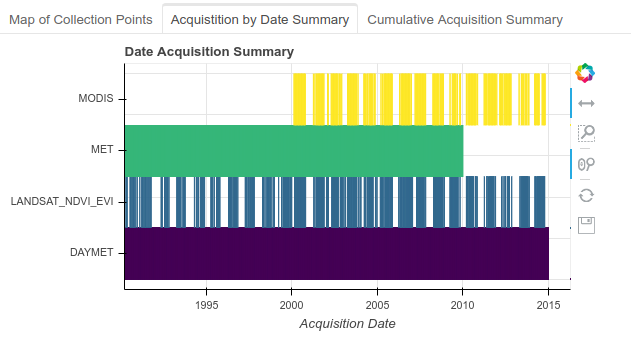

[](https://storage.googleapis.com/dacqre-badges/version.svg)
[](https://storage.googleapis.com/dacqre-badges/testing.svg)
[](https://opensource.org/licenses/MIT)

# [Welcome to dacqre!](https://gitlab.com/apis-staging/dacqre/wikis/0.-Home)


## What is dacqre?

dacqre is a **d**ata **acq**uisitions and **re**trival based toolset for extracting geospatial data, such as those used as covariates from phenological modeling, from Google Earth Engine (GEE), given a set of point locations and optional parameters. dacqre is designed to facilitate access to geospatial datasets by providing a wrapper for the GEE API and Google Cloud Platform API.  

## [Quick Setup](https://gitlab.com/apis-staging/dacqre/-/wiki_pages/0.-Home)
Go to the [dacqre wiki](https://gitlab.com/apis-staging/dacqre/-/wiki_pages/0.-Home)
to see a step-by-step walk through.

## Installation

Thank you for choosing dacqre for your data acquisition and retrieval needs. To get started, clone this repository, and follow the instructions under "Setup" and "User Guide".

## Requirements

### Google Earth Engine (GEE)

Users must have a [Google Earth Engine account](https://earthengine.google.com/) for access to data assets that will be requested. 

### Google Cloud Storage (GCS)

Users must also have a Google Cloud Storage account and an associated [bucket](https://cloud.google.com/storage/docs/creating-buckets) for data to be transfered from GEE. See following [link](https://cloud.google.com/products/search/apply/) to acquire a GCS account.

### Docker

This pipeline requires Docker to function properly. Please install [Docker CE](https://docs.docker.com/v17.12/install) for your platform, on the same machine to which you cloned this repository.

### Authentication

This pipeline requires authentication to both Google Cloud Storage and Google Earth Engine. If you do not wish to use your account, and instead use the CSP service account to log into these services, please contact [CSP](https://www.csp-inc.org/about-us/contact-us/). If, however, you wish to use your own credentials for authenticating to Cloud Storage and Earth Engine, please follow the instructions contained within the "Running Docker" section of the User Guide.

### Running Docker

The Docker container that runs the pipeline must be properly authenticated. To do so, provide your credentials by running the `./init_authenticate.sh` script, which will populate the **authentication** directory with files named "credentials" and ".boto", which will be used when running the pipeline by the "run_dacqre.sh" script.

1. credentials: This is a file containing your credentials for your Google Earth Engine account. Please follow the prompts after launching the "init_authenticate.sh" script to populate this file. The credentials file within the **authentications** directory will take the following form:
```
{"refresh_token": "1/YOUR_CREDENTIALS"}%
```
When you run the "run_dacqre.sh" script, the script will automatically mount these credentials to the appropriate place within the Docker container. 

2. .boto: This is the .boto file with which you access Google Cloud Storage. Please follow the prompts after launching the "init_authenticate.sh" script (as you did for the credentials file). The prompts will also ask for the Project ID that is associated with your GCS account, so please have that available when running the script. When you run the "run_dacqre.sh" script, the script will mount this file to the appropriate place within the Docker container. This file will be identical in form to .boto files you may have encountered when previously running gsutil.

## User Guide

### Collections

The basic building block of the dacqre pipeline is the concept of a "collection". Each collection is a set of locations for which you would like to download data from Google Earth Engine. Each collection contains a csv containing the Latitude and Longitude (in decimal degrees), along with a "PlotKey" (unique identifier), for each location in the collection. The csv name must have the following format: {COLLECTION_NAME}_points_v{VERSION_NUMBER}.csv, where by default {VERSION_NUMBER} is "1" for any new collection. The pipeline will look for this csv, along with csvs for other collections, in the *collections* folder.

### Adjusting the requested variables

The default variables to be extracted from Google Earth Engine are found in the *config* folder in the root diretory under a series of .yaml files that begin with the name "initial". These .yaml files reflect the "dynamic" and "static" data products available on GEE:

* "dynamic" products on GEE are: [LANDSAT_NDVI_EVI](https://developers.google.com/earth-engine/datasets/catalog/landsat), [MET](https://developers.google.com/earth-engine/datasets/catalog/IDAHO_EPSCOR_GRIDMET), [LANDSAT_NBR](https://developers.google.com/earth-engine/datasets/catalog/LANDSAT_LC08_C01_T1_8DAY_NBRT), [MTBS](https://www.mtbs.gov/), [DAYMET](https://developers.google.com/earth-engine/datasets/catalog/NASA_ORNL_DAYMET_V3), [MODIS](https://developers.google.com/earth-engine/datasets/catalog/MODIS_006_MOD09GQ), [MCD12Q2](https://developers.google.com/earth-engine/datasets/catalog/MODIS_006_MCD12Q2), [TERRACLIMATE](https://developers.google.com/earth-engine/datasets/catalog/IDAHO_EPSCOR_TERRACLIMATE)
* "static" products on GEE are: [CHILI](https://developers.google.com/earth-engine/datasets/catalog/CSP_ERGo_1_0_Global_SRTM_CHILI), [ELEVATION](https://developers.google.com/earth-engine/datasets/catalog/USGS/NED), [GLOBAL_ELEVATION](https://developers.google.com/earth-engine/datasets/catalog/USGS_SRTMGL1_003), [LANDCOVER](https://developers.google.com/earth-engine/datasets/catalog/USGS_NLCD)

If you want to adjust the variables that will be extracted from GEE, feel free to use the existing .yaml files as a template in order to create your own unique set of variables for extraction. Other product names can be found in the GEE data catalog *https://developers.google.com/earth-engine/datasets/*. Please be advised that if you are using non-default GEE variables, other parameters, the following parameters within the yaml files must be specified: 

- eeimgid - 	*list* GEE image id name
- instrument -	*str* The name of the instrument chosen by user
- selector_list - *list* Bands that are to be extracted
- sensors -	*str list* Labels for each image id, number of elements in this list must be the same as number of image ids. 

### Run the Pipeline

With your collections file set within the *collections* folder, complete the following steps:

1. Modify run parameters in the run_parameters.yaml file to reflect the {COLLECTION_NAME} of the collection, the {BUCKET_NAME} of the Google Cloud Storage bucket to which you will be writing output, and optionally, the run mode {RUN_MODE} (please see the "Run Modes" Section below for details).
2. After ensuring that you have run the "init_authenticate.sh" script to populate the appropriate files in the authentication folder (see the "Running Docker" section of this User Guide for details), start the pipeline using the "run_dacqre.sh" script.

#### Run Modes

- "init_only" - Performs initialization for use with diagnostics.
- "submit_only" - Performs initialization and sends tasks to GEE (This may take a long time depending on the request [hours to days]).
- "continuation" - Downloads all the requested after tasks have all completed (Be sure all tasks are complete! This can be checked by inspecting the list_of_tranfers file in the root folder).
- "full_static" - Run the full pipeline. This mode will ignore all dynamic variables and only download the static variables, ignoring the dynamic/time dependent variables.
- "full" - Run the full pipeline. This is the default if {RUN_MODE} is not specified in the run_parameters.yaml file.

### Sample Output



A sample visualization output is available [here](https://apis-staging.gitlab.io/dacqre)

## Authors

* **Eric Stofferahn** - *Initial work and development* - [CSP/SAIC](https://www.linkedin.com/in/eric-stofferahn-7a7b319/)

* **Tony Chang** - *Continued work and development* - [CSP](http://www.csp-inc.org/about-us/core-science-staff/chang-tony/)

## Contributors

* **Luke Zachmann** - *Principle investigator* - [CSP](http://www.csp-inc.org/about-us/core-science-staff/zachmann-luke/)


